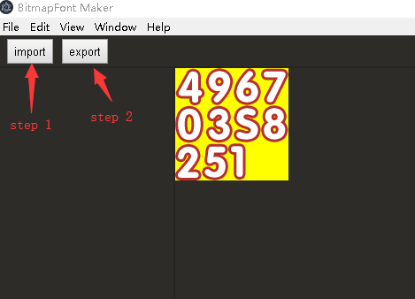

# Bitmapfont Maker
> create bitmapfont for pixi.js

### screen shot

### get start
* you'll need `nodejs` and `git` installed on you computer.
* run command `git clone https://github.com/koalaylj/bitmap-font-maker.git`
* run `cd bitmapfont-maker & npm install`
* run `npm start`to start the tool.
* set the `font images directory & output directory & fontName`:
* click `export button` to create bitmapfont files(.png & .xml).

### tips
* image file name is the letter of the font(1.png,a.png,好.png,ス.png).
* you can find the example at `example` directory .
* for now just made the example for `pixi.js`.

### Bitmapfont
* you can read `file format` document at [here](http://www.angelcode.com/products/bmfont/doc/file_format.html).
* [other tools](https://github.com/libgdx/libgdx/wiki/Bitmap-fonts).

### bin-package algorithm
* the tool use bin-package algorithm to make the atlas as small as possible.
* you can read the details about bin-package algorithm at [here](https://github.com/jakesgordon/bin-packing).